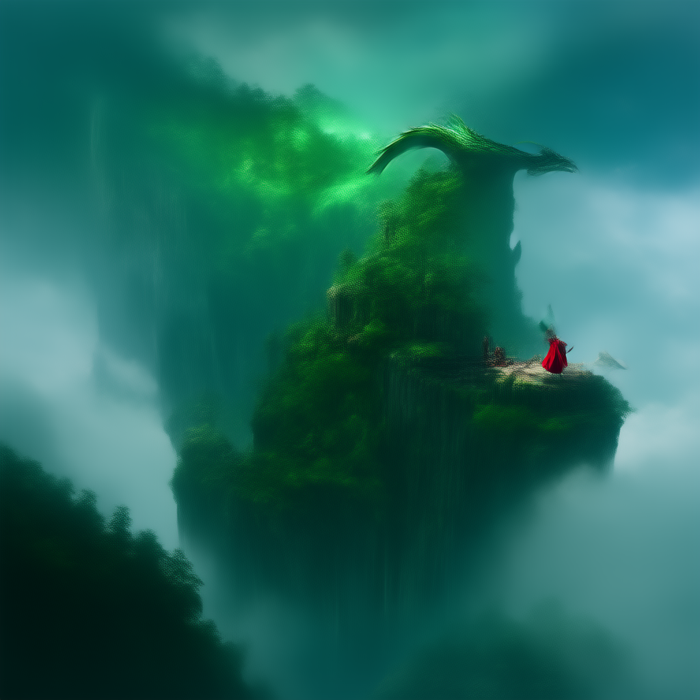
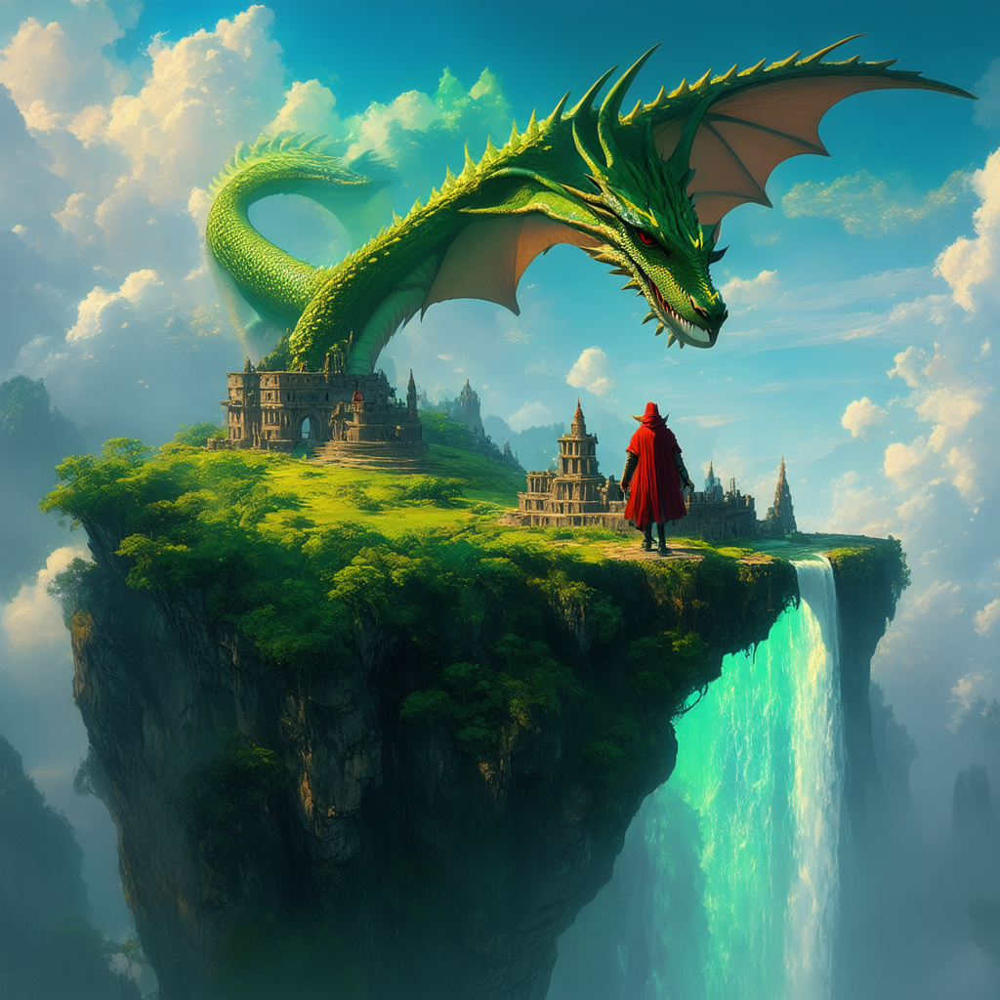
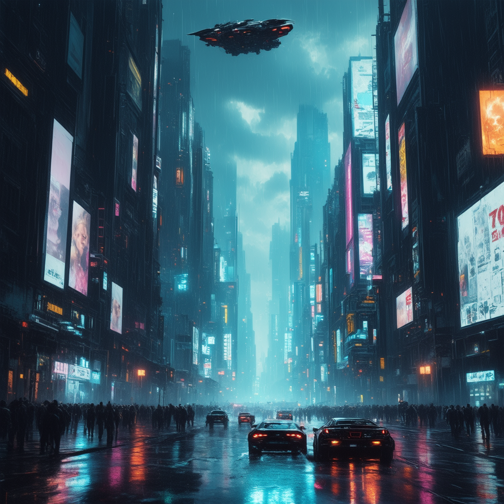

# GAN & Diffusion Models: High-Quality Image Generation


Welcome to a comprehensive exploration of state-of-the-art generative models! This repository demonstrates the power of Generative Adversarial Networks (GANs) and Diffusion Models for creating high-quality, diverse, and controllable images. Whether you're a researcher, student, or enthusiast, this project offers hands-on implementations, insightful comparisons, and creative applications.

---

## 🚀 Project Highlights

- **Multiple Generative Architectures:** DC-GAN, Conditional GAN (cGAN), Denoising Diffusion Probabilistic Models (DDPM), and Stable Diffusion.
- **Controllable Generation:** Conditional inputs for targeted outputs (e.g., specific MNIST digits, image-to-image translation).
- **Creative Applications:** From digit generation to photorealistic portraits and fantasy landscapes.
- **PyTorch Implementations:** Modular, well-documented code for easy experimentation and extension.

---

## 📦 Table of Contents
- [Overview](#overview)
- [Getting Started](#getting-started)
- [Implemented Models](#implemented-models)
- [Results](#results)
- [Technical Details](#technical-details)
- [Skills Demonstrated](#skills-demonstrated)
- [Text Prompts](#text-prompts)
- [Contributing](#contributing)
- [License](#license)

---

## Overview
This project implements and compares cutting-edge generative models, showcasing their evolution and capabilities:
- **Deep Convolutional GANs (DC-GANs):** Unconditional and conditional digit generation.
- **Conditional GANs (cGANs):** Image-to-image translation (e.g., facades from segmentation masks).
- **Diffusion Models (DDPMs):** Progressive denoising for high-fidelity image synthesis.
- **Stable Diffusion:** Advanced text-to-image generation with prompt engineering.

---

## Getting Started

1. **Clone the repository:**
   ```bash
   git clone https://github.com/yourusername/gan-diffusion.git
   cd gan-diffusion
   ```
2. **Install dependencies:**
   ```bash
   pip install -r requirements.txt
   ```
3. **Explore the main notebook:**
   Open [GAN_and_Diffusion.ipynb](GAN_and_Diffusion.ipynb) in Jupyter or Colab to run, modify, and experiment with the models.

---

## Implemented Models

### 1. DC-GAN for MNIST Generation
- Custom Deep Convolutional GAN architecture for digit synthesis
- Real-time visualization of generator/discriminator losses
- **Conditional generation:** Control specific digit outputs via label conditioning

### 2. Conditional GAN (cGAN)
- Pix2pix-style image-to-image translation
- U-Net generator with skip connections for detail preservation
- PatchGAN discriminator for high-frequency structure
- **Application:** Facade generation from segmentation masks

### 3. Diffusion Models (DDPM)
- Denoising diffusion probabilistic model implementation
- Progressive noise addition and denoising
- UNet2DModel with timestep embeddings
- **Comparison:** Quality improvement with more denoising steps

### 4. Advanced Text-to-Image Generation
- Integration with Stable Diffusion 3.5
- Custom prompt engineering for creative outputs
- High-quality images across domains (landscapes, portraits, cityscapes)

---

## Results

| Image | Description |
|-------|-------------|
|  | Fantasy landscape, 5 denoising steps |
|  | Same prompt, 40 steps (higher quality) |
|  | Futuristic cityscape, cyberpunk style |
|  | Photorealistic human portrait |

---

## Technical Details

All code, model architectures, and training procedures are in [GAN_and_Diffusion.ipynb](GAN_and_Diffusion.ipynb):
- Model definitions and hyperparameters
- Training loops and optimizers
- Visualization of generation processes
- Comparative analysis and ablation studies

---

## Skills Demonstrated
- Deep understanding of generative model architectures
- PyTorch implementation of complex neural networks
- Hyperparameter tuning for optimal results
- Conditional and controllable generation
- Integration with pre-trained diffusion models
- Image processing and evaluation

---

## Text Prompts

Custom prompts for diffusion models are in [prompts.md](prompts.md).

---

Stevan Le Stanc